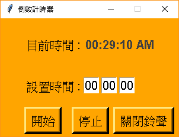

#### 安裝所需套件
`pip install -r requirements.txt`

#### 透過time套件來實作功能
- time.strftime('%H:%M:%S %p'): 時間日期格式化 (時/分/秒/AM or PM)
- time.sleep(1): 延遲1秒

#### 透過pyautogui套件來實作功能
- pyautogui.alert(): 顯示提示訊息

#### 透過tkinter套件來實作功能
- root = Tk(): 建立視窗
- root.winfo_screenwidth(): 屏幕寬度
- root.winfo_screenheight(): 屏幕高度
- root.geometry(): 設定視窗啟動時的大小與位置
- root.resizable(0,0): 固定大小

#### 透過mixer套件來實作功能
- mixer.init(): 初始化
- mixer.music.load('xxx.mp3') 讀取鈴聲
- mixer.music.play() 播放
- mixer.music.stop() 停止

#### 執行結果

